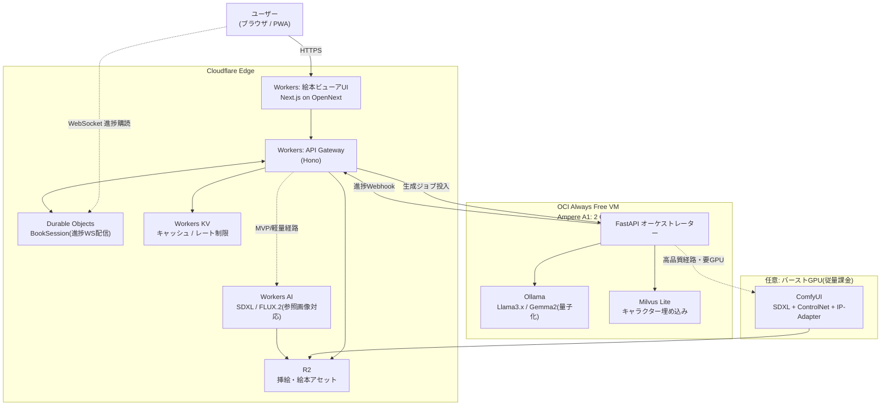
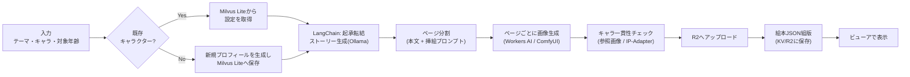

# OSS版 絵本生成AIプラットフォーム — 完全アーキテクチャ設計書

> GenStory相当の「AI絵本・教育ストーリー生成プラットフォーム」を、**Cloudflare + OCI + OSS**（Ollama/LLaMA・Gemma2、LangChain、Stable Diffusion、Milvus）のみで再構築するための設計書です。

---

## 📌 v2での方針変更(重要・最初にお読みください)

以下0〜10章は初期設計(v1)の記録として残していますが、**現在の実装(workers/, frontend/)はv2の簡略構成に切り替わっています**。

**v1(本ドキュメントの大部分が説明する内容)**: Cloudflare + OCI VM(Ollama + LangChain + Milvus Lite + FastAPI + Docker Compose) + GitHub Actions self-hosted runner + Terraform(OCI Resource Manager) + Ansible

**v2(現在の実装)**: **Cloudflareのみ**(Workers + Workers AI + R2 + KV + Durable Objects)。任意でNVIDIA NIM(build.nvidia.com無料枠)をテキスト生成に追加可能。

**変更理由**: OCI VMの準備(self-hosted runner登録、SSH接続、Terraform state管理、Ansible設定)がボトルネックとなり、動くものを完成させるまでの時間が想定より大きく伸びたため。Cloudflare Workers AIだけでもストーリー生成・挿絵生成とも実用レベルで動作するため、まずシンプルな構成で完成させ、必要になった時点でMilvus的なキャラクター記憶機能やComfyUI経由の高品質画像生成(要GPU)を追加する方針にしました。

**v1からの主な変更点**:
- Ollama/LangChain/Milvus Lite/FastAPIオーケストレーター/Docker Compose → **廃止**。ロジックはすべて`workers/src/index.ts`内のTypeScriptに統合
- OCI VM・self-hosted runner・Terraform(OCI)・Ansible → **廃止**
- 画像生成: 既定でCloudflare Workers AI(FLUX)。ControlNet/Stable Diffusionは、NVIDIA NIMも含め無料のホスト型APIでは提供されておらず(自前GPUでの`docker run`が必要)、当面は見送り
- ストーリー生成: Cloudflare Workers AI(既定)。`NVIDIA_NIM_API_KEY`を設定すると NVIDIA NIM(無料ホスト型テキストAPI)を優先使用し、失敗時はWorkers AIへ自動フォールバック
- キャラクターの長期記憶(Milvusが担っていた機能)は現状未実装。1冊の生成内ではキャラクター設定をそのままプロンプトに含める方式で対応

現在の構成の詳細は [`README.md`](../README.md) と [`github-actions-setup.md`](./github-actions-setup.md) を参照してください。以下はv1設計の記録です。

---

## 0. 設計に入る前に：4つの前提を最新情報で検証

要件をそのまま実装すると本番で詰まる箇所が4つあったため、最新情報を確認したうえで設計に反映しています。

| # | 当初の想定 | 確認した現状（2026年7月時点） | 設計への反映 |
|---|---|---|---|
| 1 | OCI Always FreeのArm A1は4 OCPU/24GB | **2026年6月15日、公式アナウンスなしに2 OCPU/12GBへ半減**。PAYG（従量課金）アカウントは4/24のまま使えるとの報告もあるがサポート回答は一貫しておらず、恒久的な抜け道として設計に組み込むのは危険 | **12GBを前提にサイジング**。無料枠の仕様変更を監視する運用を「9. 運用戦略」に明記 |
| 2 | Milvus（フル版）をDocker Composeで常時起動 | Milvus Standaloneは単体でもetcd/MinIO込みで数GB以上のメモリを常時消費し、12GB環境ではOllamaと同居が厳しい。一方 **Milvus Lite**（Pure Python・pip installのみ・etcd/MinIO不要）は数百万ベクトル規模まで対応し、クライアントAPIはStandaloneと共通 | キャラクター設定ベクトル（1ユーザーあたり数件〜数十件）は **Milvus Liteで十分**。将来的にStandalone/Distributedへ無停止で移行可能な設計にする |
| 3 | Cloudflare Pagesで絵本ビューアを配信 | Cloudflareおよび Next.js 開発元は、Next.jsをCloudflareへデプロイする方法として**Workers + OpenNextアダプタ**（`@opennextjs/cloudflare`）を公式推奨に切り替え済み。`@cloudflare/next-on-pages`は非推奨化され、Pagesは静的サイトかEdge Runtime限定機能向けの位置づけに後退 | ビューアUIは **Cloudflare Workers（OpenNext）** としてデプロイ。ユーザーから見た体験は変わらないが、内部構成をアップデート |
| 4 | OCIの無料VM上でStable Diffusionも推論する | OCI Always FreeにGPUは**一度も提供されたことがない**（Ampere A1はCPUのみ）。SDXLをCPU推論すると1枚あたり数分〜十数分かかり、12GBメモリでOllama・Milvusと同居させるとメモリ不足になる可能性が高い | 画像生成をOCI VMから分離。**既定経路はCloudflare Workers AI**（SDXL/FLUXをOSSモデルとしてサーバーレス実行、1日1万Neuron無料）とし、本格運用時はスポットGPU等にComfyUI＋ControlNet＋IP-Adapterをオンデマンド起動する二段構成にする |

補足として、「完全オープンソースのみで」という方針と、要件4で指定されている Cloudflare Workers/Pages の採用は厳密には両立しません（Workersの実行基盤である`workerd`自体はApache-2.0のOSSですが、KV・R2・Queues・Durable Objectsはマネージドの商用サービスです）。本設計書はご要件どおりCloudflareをエッジ層として採用しつつ、**推論・生成ロジックは100% OSSモデル/フレームワークで構成する現実的な折衷案**として組み立てています。完全self-hostにこだわる場合の代替（MinIO / Redis / NATS等）は末尾の付録に記載しました。

---

## 1. 全体アーキテクチャ図



**リクエストフロー**
1. ユーザーがビューアUI（Workers上のNext.js）でテーマ・キャラクター・対象年齢を入力
2. API Gateway WorkerがDurable Object（book session）を生成し、進捗購読用WebSocketのURLをクライアントへ返す
3. Gatewayが生成ジョブをOCI VM上のFastAPIオーケストレーターへ投入
4. オーケストレーターが Ollama（ストーリー生成）→ Milvus Lite（キャラクター一貫性RAG）→ 挿絵生成（既定：Workers AI／高品質経路：ComfyUI）の順に処理し、ページ完了ごとにWebhookでGatewayへ進捗を送信
5. GatewayはDurable Object経由でクライアントへリアルタイムに進捗をpushし、完成した挿絵はR2に保存
6. 完成した絵本データ（本文＋画像URL）はKV/R2にJSONとして保存され、ビューアがページめくりUIで表示

---

## 2. 使用OSS一覧

| レイヤー | コンポーネント | ライセンス | 役割 |
|---|---|---|---|
| LLM推論 | [Ollama](https://ollama.com) | MIT | Llama3.x / Gemma2をローカルAPI化 |
| LLMオーケストレーション | [LangChain](https://python.langchain.com) (`langchain-core`, `langchain-ollama`, `langchain-milvus`) | MIT | 起承転結プロンプト、構造化出力、RAG |
| ベクトルDB | [Milvus Lite](https://github.com/milvus-io/milvus-lite) | Apache-2.0 | キャラクター設定の埋め込み検索（将来Standalone/Distributedへ移行可） |
| 画像生成（自前ホスト時） | [ComfyUI](https://github.com/comfyanonymous/ComfyUI) | GPL-3.0 | SDXL/Flux等のノードベース画像生成 |
| モデル | Stable Diffusion XL / 各種OSSチェックポイント | CreativeML OpenRAIL++ 等（モデルごとに要確認） | 挿絵の描画 |
| 構図制御 | ControlNet | Apache-2.0 (実装による) | 構図・ポーズの安定化 |
| キャラ一貫性 | IP-Adapter | Apache-2.0 | 参照画像ベースのキャラクター一貫性 |
| バックエンド | [FastAPI](https://fastapi.tiangolo.com) | MIT | 推論オーケストレーション・Webhook送出 |
| コンテナ基盤 | Docker / Docker Compose | Apache-2.0 | OCI VM上の各コンポーネント管理 |
| フロントエンド | [Next.js](https://nextjs.org) | MIT | 絵本ビューアUI（App Router） |
| デプロイアダプタ | [OpenNext for Cloudflare](https://opennext.js.org/cloudflare) | MIT | Next.jsをCloudflare Workersへビルド |
| APIルーティング | [Hono](https://hono.dev) | MIT | Workers上の軽量ルーター |

> Cloudflare Workers / KV / R2 / Queues / Durable Objects / Workers AI は上表に含めていません。これらはCloudflareのマネージド商用サービス（実行基盤`workerd`のみApache-2.0 OSS）であり、要件4の指定に基づき「エッジ配信・API Gateway・（任意の）画像生成バックアップ経路」として採用しています。

---

## 3. 絵本生成パイプライン



各ステップの実装対応は次のとおりです。

| ステップ | 実装 |
|---|---|
| キャラクター設定の取得/保存 | `langchain/story_chain.py` の `retrieve_character_context` / `save_character_profile` |
| 起承転結ストーリー生成 | `langchain/story_chain.py` の `generate_storybook`（4章で詳説） |
| ページごとの画像生成 | `langchain/orchestrator.py` の `generate_illustration`（5章で詳説） |
| 進捗のリアルタイム配信 | `workers/src/index.ts` の `BookSession` Durable Object（7章で詳説） |
| 絵本アセットの保存/配信 | Cloudflare R2 + `GET /api/assets/:key`（7章） |


---

## 4. LangChainコード（起承転結ストーリー生成）

Pydanticモデルで「ページ番号・起承転結の役割・本文・挿絵プロンプト」を型として定義し、`with_structured_output` でLLM出力を直接構造化データへパースします。キャラクター設定はMilvus Liteに保存し、同じキャラクターが再登場する際は前回の見た目・性格をRAGで引き当てて一貫性を保ちます。

完全なファイルは `langchain/story_chain.py` を参照してください（実行可能な完全版です）。核となる部分の抜粋:

```python
class NarrativeStage(str, Enum):
    KI = "起"    # 導入
    SHO = "承"   # 展開
    TEN = "転"   # 転換・クライマックス
    KETSU = "結"  # 結末


class StoryPage(BaseModel):
    page_number: int
    stage: NarrativeStage
    text: str = Field(..., description="対象年齢に応じた語彙・文長の本文")
    illustration_prompt: str = Field(..., description="英語の画像生成プロンプト(構図・動作中心)")


class Storybook(BaseModel):
    title: str
    pages: List[StoryPage]


SYSTEM_PROMPT = """あなたは子供向け絵本のベテラン作家です。
「起承転結」の4部構成に厳密に従い、対象年齢に適した語彙と文の長さで物語を書いてください。

- 起(15〜20%): 主人公・舞台・日常を紹介する
- 承(30〜35%): 出来事が展開し、小さな課題や冒険が始まる
- 転(25〜30%): 予想外の出来事や最大の山場が訪れる
- 結(15〜20%): 課題が解決し、温かい余韻で締めくくる

安全上の注意:
- 暴力・恐怖描写・差別的表現は避けること
- illustration_prompt には既存キャラクターの visual_description を必ず反映し、
  ページ間で見た目が変わらないようにすること
"""

# Milvus Liteはローカルの .db パスを渡すだけで自動起動する(etcd/MinIO不要)
character_store = Milvus(
    embedding_function=OllamaEmbeddings(model="bge-m3", base_url=OLLAMA_BASE_URL),
    connection_args={"uri": "./data/character_store.db"},
    collection_name="character_profiles",
    auto_id=True,
)

llm = ChatOllama(model="llama3.1:8b-instruct-q4_K_M", base_url=OLLAMA_BASE_URL, temperature=0.8)
structured_llm = llm.with_structured_output(Storybook)

def generate_storybook(user_id, theme, age_group, characters, page_count=8) -> Storybook:
    character_context = build_character_context(user_id, characters)  # Milvus Liteからキャラ設定を取得/保存
    chain = prompt | structured_llm
    return chain.invoke({
        "theme": theme, "age_group": age_group,
        "page_count": page_count, "character_context": character_context,
    })
```

**設計上のポイント**
- `bge-m3`（多言語対応埋め込み、Ollamaで動作）を採用し、日本語のキャラクター名・特徴量での類似検索精度を確保しています。英語中心の `nomic-embed-text` 等より日本語利用に適しています。
- 本文生成のベースモデルは要件どおり Llama3.x / Gemma2 を既定としていますが、児童書らしい自然な日本語にするため、**Llama-3.1-Swallow系やELYZA系などの日本語継続事前学習モデル**（Ollama Hub経由で利用可）への差し替えも検討してください。
- `with_structured_output` はOllama側がtool-calling/JSON modeに対応したモデルである必要があります。対応が不安定な場合は `PydanticOutputParser` を使い、フォーマット指示をプロンプトに明示する方式にフォールバックしてください。
- Milvus Liteは**認証機能を持たない**（RBACなし）ため、`user_id` によるフィルタはアプリ側の責務です。オーケストレーターでは、クライアントが指定した値をそのまま信用せず、認証済みセッションから導出した `user_id` を使ってください（詳細は9章）。

---

## 5. Stable Diffusion / 挿絵生成 設定

### 5.1 生成経路を2段構成にする理由

OCI Always Free VMにGPUは存在しないため、この箱でSDXLをCPU推論すると1024px・20stepsで**数分〜十数分/枚**かかり、Ollama・Milvus Liteとメモリを取り合います。そのため画像生成は次の2経路のハイブリッドとします。

| 経路 | 用途 | モデル | 備考 |
|---|---|---|---|
| **既定（MVP・低トラフィック）** | Cloudflare Workers AI | `@cf/black-forest-labs/flux-1-schnell`（高速）/ `@cf/stabilityai/stable-diffusion-xl-base-1.0` | サーバーレス・GPU管理不要。1日1万Neuron無料、以降 $0.011/1,000 Neuron。**FLUX.2は最大4枚の参照画像を条件付けに使える**ため、キャラクターの参照画像を渡すだけで簡易的なキャラ一貫性が得られる |
| **高品質・本格運用** | 自前ComfyUI（別途GPU） | SDXL + ControlNet + IP-Adapter | 構図・キャラ一貫性を細かく制御したい場合に、スポットGPU（RunPod等）やOCIの有償GPUシェイプでオンデマンド起動 |

### 5.2 挿絵スタイルとプロンプト設計

- **画風**: 児童書らしい柔らかい水彩・パステル調を基本に、`illustration_prompt` の末尾に固定のスタイルサフィックスを付与して全ページの画風を統一します。
  例: `..., soft watercolor children's book illustration, pastel palette, gentle lighting, simple shapes, no text`
- **キャラ一貫性（自前ComfyUI利用時）**: IP-Adapterに主人公の参照画像（初回生成時のベストショットをMilvus Liteのメタデータと紐付けて保存）を渡し、以降のページはこれを条件として利用。構図の破綻を防ぐため、ControlNet（OpenPose or Lineart）で大まかなポーズ・構図を軽く固定します。
- **解像度**: ビューアの見開き表示を想定し `1024x768`（4:3）または `1216x832` を基本とします。
- **サンプラー/ステップ数の目安**: FLUX.1 schnellは4〜8 step、SDXLは20〜30 step、CFG scaleは5〜7程度から調整してください（モデル・LoRAにより最適値は変わるため実際にABテストすることを推奨）。

### 5.3 子供向けコンテンツとしてのネガティブプロンプト

```
negative_prompt = (
    "scary, violent, weapon, blood, horror, dark themes, "
    "realistic human face, photorealistic, text, watermark, "
    "extra limbs, deformed hands, nsfw"
)
```

生成後は本文・挿絵プロンプトの双方に対して軽量な不適切コンテンツチェック（9章参照）を通過させてからR2へ保存する運用を推奨します。

---

## 6. Docker Compose（OCI VM側）

2 OCPU/12GBという制約の中で確実に動かすため、`profiles` で「常時起動するcore」と「任意・高負荷なsd-gpu」を分離しています。完全な内容は `infra/docker-compose.yml` を参照してください。

```yaml
services:
  ollama:
    image: ollama/ollama:latest
    restart: unless-stopped
    ports: ["11434:11434"]
    volumes: ["ollama_data:/root/.ollama"]
    deploy:
      resources:
        limits: { memory: 6g }
    profiles: ["core"]

  orchestrator:
    build: { context: ./orchestrator }
    restart: unless-stopped
    ports: ["8000:8000"]
    environment:
      - OLLAMA_BASE_URL=http://ollama:11434
      - OLLAMA_MODEL=llama3.1:8b-instruct-q4_K_M
      - EMBEDDING_MODEL=bge-m3
      - MILVUS_LITE_PATH=/data/character_store.db
    volumes: ["milvus_lite_data:/data"]
    depends_on: [ollama]
    deploy:
      resources:
        limits: { memory: 3g }
    profiles: ["core"]

  # 任意: 自前GPUマシン/バーストGPUインスタンスでのみ有効化する
  # ComfyUIには公式Dockerイメージが存在しないため、コミュニティメンテの
  # yanwk/comfyui-boot を例として使用(採用前に最新READMEを要確認)
  comfyui:
    image: yanwk/comfyui-boot:cu124-slim
    restart: unless-stopped
    ports: ["8188:8188"]
    volumes: ["sd_models:/root/ComfyUI/models", "sd_output:/root/ComfyUI/output"]
    deploy:
      resources:
        reservations:
          devices: [{ driver: nvidia, count: all, capabilities: [gpu] }]
    profiles: ["sd-gpu"]

volumes:
  ollama_data:
  milvus_lite_data:
  sd_models:
  sd_output:
```

起動コマンド:
```bash
# OCI VM(常時): Ollama + オーケストレーターのみ
docker compose --profile core up -d

# GPUを積んだ別マシン(任意・スポット起動): ComfyUIのみ
docker compose --profile sd-gpu up -d
```

**メモリ配分の目安（12GB環境）**

| コンポーネント | 想定使用量 | 備考 |
|---|---|---|
| OS + Docker | 〜1.5GB | |
| Ollama（8B Q4量子化モデル） | 〜6GB | コンテキスト長次第で増減 |
| orchestrator + Milvus Lite | 〜1〜2GB | ベクトル件数が少ない前提 |
| 余裕（バースト・ページキャッシュ） | 〜2.5GB | |

この配分だとSDXLの同居は現実的でないため、5章のとおり画像生成をOCI VM外に切り出す設計にしています。

---

## 7. Cloudflare Workers ルーティング（API Gateway）

Hono・Durable Objects WebSocket Hibernation API・KV・R2を組み合わせたAPI Gatewayです。完全なコードは `workers/src/index.ts`、設定は `workers/wrangler.jsonc` を参照してください。

**エンドポイント一覧**

| メソッド | パス | 役割 |
|---|---|---|
| `POST` | `/api/books` | 絵本生成を開始し、`bookId` とWebSocket URLを返す（KVでレート制限） |
| `GET` | `/api/books/:id/ws` | 進捗購読用WebSocketへアップグレード（Durable Object経由） |
| `GET` | `/api/books/:id/status` | 進捗のポーリング用フォールバック |
| `POST` | `/api/books/:id/webhook` | OCIオーケストレーターからの進捗通知受信（共有シークレットで検証） |
| `GET` | `/api/assets/:key` | R2に保存された挿絵の配信 |

**Durable Object（`BookSession`）の要点**

```typescript
export class BookSession extends DurableObject<Env> {
  async fetch(request: Request): Promise<Response> {
    // /ws への Upgrade リクエストを受け取り WebSocket Hibernation API で受理する
    const pair = new WebSocketPair();
    const [client, server] = Object.values(pair);
    this.ctx.acceptWebSocket(server);   // server.accept() は使わない(レガシーAPI)
    return new Response(null, { status: 101, webSocket: client });
  }

  async webSocketMessage(ws: WebSocket, message: string | ArrayBuffer) {
    if (message === "ping") ws.send("pong");
  }

  async webSocketClose(ws: WebSocket, code: number, reason: string) {
    ws.close(code, "Durable Object is closing WebSocket");
  }

  private broadcast(payload: unknown) {
    const message = JSON.stringify(payload);
    for (const ws of this.ctx.getWebSockets()) ws.send(message);
  }
}
```

- `this.ctx.acceptWebSocket()` を使うことで、進捗待ちの間Durable Objectがメモリに常駐せず休止（ハイバネーション）できます。
- 進捗通知（`/webhook`）を受けるたびに `broadcast()` で接続中のクライアントへ配信し、`ctx.storage` に最新状態を保存することでポーリングにも同じ状態を返せます。
- `wrangler.jsonc` では `migrations[].new_sqlite_classes` にDurable Objectクラス名を指定する必要があります（Agentや状態保持を伴うDOの必須設定）。

**セキュリティ**
- `/webhook` は `X-Webhook-Secret` ヘッダーで検証し、OCI側以外からの偽装通知を拒否
- `/api/books` はKVベースの簡易レート制限（IPごと1時間10回）
- `ORCHESTRATOR_TOKEN` / `WEBHOOK_SECRET` は `wrangler secret put` で登録し、`wrangler.jsonc` にはベイクしない

---

## 8. Next.js UI構成（絵本ビューア）

```
frontend/
├── app/
│   ├── page.tsx                  # トップ: テーマ・キャラクター入力フォーム
│   ├── books/[id]/
│   │   ├── page.tsx              # 生成中は進捗表示 → 完成後はビューアへ切替
│   │   └── loading.tsx
│   └── layout.tsx
├── components/
│   ├── StoryForm.tsx             # テーマ / 対象年齢 / キャラクター入力
│   ├── GenerationProgress.tsx    # useBookSocket を使った進捗UI
│   └── BookViewer/
│       ├── PageFlip.tsx          # ページめくりUI
│       └── PageView.tsx
├── lib/
│   ├── useBookSocket.ts          # WebSocket購読フック(下記・完全版はfrontend/lib/)
│   └── apiClient.ts              # Workers APIへのfetchラッパー
├── open-next.config.ts           # OpenNextアダプタ設定(キャッシュ等)
└── wrangler.jsonc                # `main: ".open-next/worker.js"` 等、ビルド時に自動生成
```

デプロイは `@opennextjs/cloudflare` を使用します（0章参照）。

```bash
npm i -D @opennextjs/cloudflare wrangler
npx opennextjs-cloudflare build
npx opennextjs-cloudflare deploy
```

進捗購読フックの抜粋（完全版は `frontend/lib/useBookSocket.ts`）:

```typescript
export function useBookSocket(bookId: string | null, apiBaseUrl: string) {
  const [progress, setProgress] = useState<BookProgress>({ status: "idle" });
  const [pages, setPages] = useState<Record<number, string>>({});

  useEffect(() => {
    if (!bookId) return;
    const ws = new WebSocket(`${apiBaseUrl.replace(/^http/, "ws")}/api/books/${bookId}/ws`);
    ws.onmessage = (event) => {
      const payload: BookProgress = JSON.parse(event.data);
      setProgress(payload);
      if (payload.status === "page_complete" && payload.pageNumber && payload.imageUrl) {
        setPages((prev) => ({ ...prev, [payload.pageNumber!]: payload.imageUrl! }));
      }
    };
    return () => ws.close();
  }, [bookId, apiBaseUrl]);

  return { progress, pages };
}
```

UI文言は「システムが何をしているか」ではなく「利用者から見て何が起きているか」で書くことを推奨します（例: `Webhook受信中...` ではなく `3ページ目のイラストを描いています...`）。

---

## 9. 運用戦略

### 9.1 無料枠の変動リスクへの備え
2026年6月のOCI Always Free半減は事前告知なしに実施されました。無料インフラに依存する以上、**契約変更を前提にしない運用**が必要です。
- OCI: 「Limits, Quotas and Usage」ページを定期確認し、リソース超過時に自動でアラートが飛ぶよう監視を設定
- Cloudflare: Workers / KV / R2 / Queues / Workers AIそれぞれの無料枠使用量をダッシュボードで監視し、閾値超過が続く場合はWorkers Paid（$5/月〜）への切替を検討
- いずれの無料枠も「壊れたら即座に有償プランへフェイルオーバーできる」構成（Terraform/Docker Composeでの再現性確保）にしておく

### 9.2 コンテンツモデレーション（子供向けサービスとしての配慮）
- **生成時**: システムプロンプトで暴力・恐怖・差別表現を明示的に禁止し、ネガティブプロンプト（5.3節）を全画像生成に適用
- **生成後チェック**: 本文・挿絵プロンプトの両方に対し、軽量な分類（キーワードフィルタ＋必要に応じて別LLM呼び出しでのセルフチェック）を通過したものだけをR2へ保存・公開
- **保護者/運営によるレビュー**: 不適切と判断された絵本を事後にフラグ・非公開化できる仕組みをオーケストレーター側に用意

### 9.3 監視・ロギング
- Cloudflare側: `wrangler.jsonc` の `observability.enabled: true` でWorkersのログ・トレースを収集
- OCI側: `docker stats` ベースの簡易監視、または Prometheus + Grafana（軽量構成ならNode Exporterのみでも可）でOCPU/メモリを監視し、12GB上限への接近をアラート化

### 9.4 スケーリング戦略
- 現構成は単一OCI VMが前提。トラフィック増加時のアップグレードパス:
  1. Milvus Lite → Milvus Standalone（同一クライアントAPIのためコード変更は最小限）
  2. Ollamaを複数VM/インスタンスに分けてオーケストレーター側でロードバランス
  3. 画像生成はWorkers AI中心のためOCI VM自体のスケール制約を受けにくい設計になっている

### 9.5 セキュリティ
- Webhook共有シークレット・KVベースのレート制限（7章で実装済み）
- **Milvus Liteはネイティブ認証機能を持たない**ため、`user_id`はクライアント指定値をそのまま信用せず、認証済みセッション（Cookie/JWT等）から導出すること
- 入力サニタイズ（テーマ・キャラクター名等の自由入力はプロンプトインジェクション対策としてLLMに渡す前にエスケープ/長さ制限）
- 秘密情報は`wrangler secret put`および`.env`（Git管理外）で管理し、コードにベイクしない

### 9.6 バックアップ / DR
- Milvus Liteの `.db` ファイルとOllamaモデルはOCIブロックボリュームの定期スナップショットで保護
- 生成済み絵本（R2）はCloudflareの耐久性設計に依存しつつ、重要データは定期的に別ストレージへエクスポートすることを推奨

### 9.7 CI/CD
- GitHub Actions例:
  - `workers/` `frontend/` それぞれで `wrangler deploy` / `opennextjs-cloudflare deploy`
  - `orchestrator/` はDockerイメージをビルドし、OCI VMへSSH経由でpull&再起動（またはプライベートレジストリ経由）

---

## 10. コスト試算（月額の目安）

| 項目 | 想定コスト | 備考 |
|---|---|---|
| OCI Always Free VM | ¥0 | 2 OCPU/12GB, 200GBブロックストレージ。**恒久保証ではない点に注意**（0章） |
| Cloudflare Workers/KV/R2/Queues/DO | 概ね無料枠内〜$5/月 | トラフィック次第でWorkers Paidへ |
| Cloudflare Workers AI（画像生成） | 数百円〜数千円/月 | 1日1万Neuron無料、以降$0.011/1,000 Neuron。画像1枚あたりのNeuron消費はモデル・ステップ数依存のため[料金ページ](https://developers.cloudflare.com/workers-ai/platform/pricing/)で要確認 |
| バーストGPU（任意・高品質経路） | 従量課金（利用時のみ） | スポットGPU相場は概ね$0.2〜0.5/時間。生成量が増えてきたタイミングで導入を検討 |

---

## 付録

### A. リポジトリ構成
```
genstory-oss/
├── docs/architecture.md
├── infra/docker-compose.yml
├── workers/
│   ├── wrangler.jsonc
│   └── src/index.ts
├── langchain/
│   ├── story_chain.py
│   └── orchestrator.py
└── frontend/
    └── lib/useBookSocket.ts
```

### B. 完全self-hostを追求する場合の代替スタック
Cloudflareを一切使わずゼロベンダーロックインを狙う場合の置き換え候補です（運用負荷は大きく増えます）。

| Cloudflareコンポーネント | 完全OSS代替 |
|---|---|
| Workers（API Gateway） | Kong / Nginx + 任意言語のAPIサーバー |
| R2（オブジェクトストレージ） | MinIO（S3互換、OCIのブロックストレージ上にホスト） |
| KV | Redis / Valkey |
| Queues | NATS / RabbitMQ |
| Durable Objects（進捗WS配信） | Redis Pub/Sub + 任意のWebSocketサーバー |
| Workers AI | ComfyUI常時起動（要GPU） |

### C. 参考
- OCI Always Free仕様変更の報告（2026年6月〜）: InfoQ, linuxiac.com 等の技術メディア報道
- Milvus Lite: https://github.com/milvus-io/milvus-lite
- OpenNext for Cloudflare: https://opennext.js.org/cloudflare
- Cloudflare Workers AI モデル一覧: https://developers.cloudflare.com/workers-ai/models/
